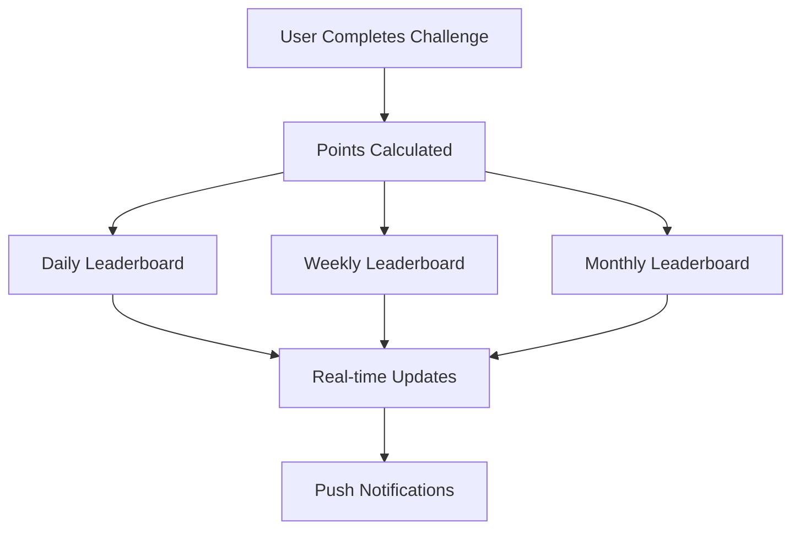
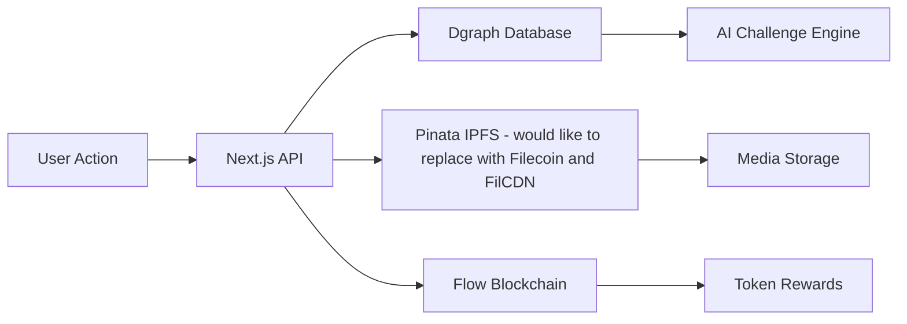
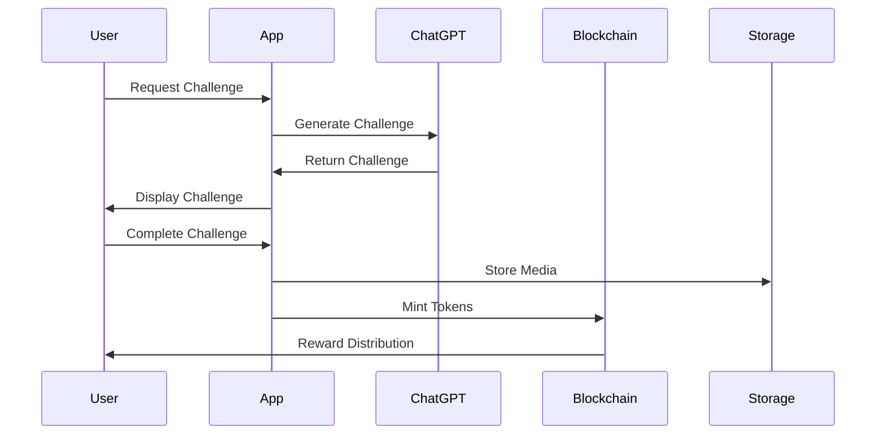

# Nocena - Hackathon Implementation
*Challenge-based Social Network with AI-Generated Challenges & Blockchain Rewards*

## 🏆 Hackathon Achievement Overview

Nocena is a **live application** currently in **private beta** launching July 22nd, 2025, with a small group of testers. This hackathon implementation represents significant technical advancement in our existing social networking platform that combines AI-generated challenges with blockchain rewards.

## 🚀 Recent Milestones & Recognition

- **Binstarter Launchpad Acceleration**: Accepted into MAP program with complete redesign of web presence, pitch deck, whitepaper, and professional tokenomics
- **Lens Spring Hackathon Winner**: Prize recipient and member of Lens Developer Program
- **CryptoKnights TV Show**: Secured spot last week for filming in August/September, airing to millions on TV, Amazon Prime, and Apple TV+ in December
- **Token Sale**: Scheduled for mid-August 2025

## 🔧 Hackathon Technical Implementations

### 1. **Verifiable Human Protocol (VHP) Integration**
- Successfully integrated VHP developed at ETH Prague into main project
- Enhanced human verification system for authentic user interactions
- Proof-of-humanity mechanisms to prevent bot activities

### 2. **Account Abstraction with Thirdweb**
- Complete redesign of registration process
- Seamless onboarding for users without crypto knowledge
- Smooth wallet creation and management through thirdweb integration
- Eliminated technical barriers for mainstream adoption

### 3. **Competitive Leaderboard System**

- Multi-tier competitive structure (Daily/Weekly/Monthly)
- Real-time scoring and ranking system
- Gamification elements driving user engagement

### 4. **AI-Powered Challenge Generation**
- ChatGPT integration for dynamic challenge creation and checking of completion
- Context-aware challenge suggestions based on user behavior
- Automated notification system within PWA framework

### 5. **Flow Blockchain Token Implementation**
- Nocenix token deployed on Flow blockchain
- Separate repository: [Nocenix Token](https://github.com/cadenpiper/Nocenix)
- Integrated reward distribution system

### 6. **Filecoin & FilCDN Storage Solution**
- Implemented decentralized storage with Filecoin
- FilCDN integration for content delivery (FilCDN branch)
- Currently in testing phase before production deployment

### 7. **FilCDN Livestream Foundation**
- Basic livestream infrastructure for influencer monetization
- Vision for real-world challenge streaming vs. traditional social media
- Alternative to TikTok's random streaming model
- **Note**: FilCDN implementation is on the FilCDN branch and requires additional testing before merging to main

## 📊 Technical Architecture

### Backend Flow


### Challenge Completion Pipeline


## 🎯 Next 3 Months Roadmap

### July 2025
- **ChainGPT Partnership**: NFT minting integration for challenge rewards
- **Flow Grant Submission**: Results expected mid-August
- **Token Sale Launch**: Mid-August deployment

### August 2025
- **Complete Token Integration**: Full tokenomics implementation with locking, burning, and redistribution mechanisms
- **AI Behavior Learning**: Graph database optimization for user-specific challenge generation
- **Face Detection Models**: One-profile-per-human verification system

### September 2025
- **Social Features**: Chat and group challenge systems
- **Deep VHP Integration**: On-chain proof of humanity storage
- **Influencer Tokenization**: Platform for influencer token launches backed by Nocenix

## 💰 Investment & Funding

**Current Goal**: $50,000 investment to optimize platform for CryptoKnights appearance
- Preparation for global TV exposure
- Technical infrastructure scaling
- User acquisition campaigns

## 🛠 Technical Stack

**Frontend**: Next.js, TypeScript, Tailwind CSS
**Backend**: Integrated Next.js APIs
**Database**: Dgraph (optimized for behavior analysis)
**Storage**: Pinata IPFS, Filecoin (testing)
**Blockchain**: Flow (Nocenix token), Polygon (challenge rewards)
**AI**: ChatGPT API integration
**Authentication**: Thirdweb account abstraction

## 📱 PWA Features

- **Offline Capability**: Service worker implementation
- **Push Notifications**: Real-time challenge updates
- **Camera Integration**: HTTPS development for media capture
- **Installation Prompts**: Cross-platform app installation

## 🔒 Security & Verification

- **VHP Integration**: Verifiable human protocol
- **Rate Limiting**: Brute force protection
- **Acount Abstraction**: For mainstream users

## 🌟 Future Vision

**Livestream Integration**: FilCDN-powered real-world challenge streaming
**Deep AI Personalization**: Machine learning for goal-oriented challenge generation
**Influencer Economy**: Tokenized creator monetization
**Global Expansion**: Preparation for mainstream adoption post-TV appearance

## 🚀 Getting Started

### Prerequisites
- Node.js (Latest LTS)
- pnpm
- Git

### Installation
```bash
git clone https://github.com/Nocena/app.nocena.git
cd app.nocena
pnpm install
```

### Environment Variables
Create a `.env` file in the root directory with the following variables:

```env
# Dgraph Database
NEXT_PUBLIC_DGRAPH_API_KEY=your_dgraph_api_key
NEXT_PUBLIC_DGRAPH_ENDPOINT=your_dgraph_endpoint

# Pinata IPFS Storage
PINATA_API_KEY=your_pinata_api_key
PINATA_SECRET_KEY=your_pinata_secret_key
NEXT_PUBLIC_PINATA_JWT=your_pinata_jwt_token

# Map Integration
NEXT_PUBLIC_JAWG_ACCESS_TOKEN=your_jawg_access_token

# Admin & Security
ADMIN_SEED_KEY=your_admin_seed_key

# OpenAI API
OPENAI_API_KEY=your_openai_api_key

# Push Notifications (VAPID)
VAPID_SUBJECT=mailto:your_email@domain.com
VAPID_PRIVATE_KEY=your_vapid_private_key
NEXT_PUBLIC_VAPID_PUBLIC_KEY=your_vapid_public_key

# Blockchain & Wallet Integration
NEXT_PUBLIC_WALLETCONNECT_PROJECT_ID=your_walletconnect_project_id
NEXT_PUBLIC_APP_ADDRESS=your_app_contract_address
NEXT_PUBLIC_THIRDWEB_CLIENT_ID=your_thirdweb_client_id
THIRDWEB_SECRET_KEY=your_thirdweb_secret_key

# Filecoin Integration
FILECOIN_PRIVATE_KEY=your_filecoin_private_key
FILECOIN_RPC_URL=https://api.calibration.node.glif.io/rpc/v1
```

### Development

#### Standard Development Mode
```bash
pnpm dev
```
Access the app at [http://localhost:3000](http://localhost:3000)

#### HTTPS Development Mode (Required for Camera Access)

Camera functionality requires a secure context (HTTPS). Choose one of the following methods:

**Option 1: Using ngrok (Recommended for mobile testing)**
```bash
# Install ngrok globally
npm install -g ngrok

# Start your development server
pnpm dev

# In another terminal, expose your local server
ngrok http 3000
```
This provides you with a public HTTPS URL that you can use on any device.

**Option 2: Local SSL Certificates**
```bash
# Create certificates directory
mkdir -p certificates

# Generate SSL certificates using mkcert
npx mkcert-cli install
npx mkcert-cli create localhost 127.0.0.1 ::1 -o ./certificates

# Ensure files are named correctly
# Generated files should be: dev.cert and dev.key in certificates/

# Start HTTPS development server
pnpm dev:https
```
Access the app at [https://localhost:3001](https://localhost:3001) or `https://[YOUR-LOCAL-IP]:3001` on mobile devices.

**Important Notes:**
- Accept certificate warnings in your browser (expected with self-signed certificates)
- For iOS testing, ngrok is preferred as it avoids certificate installation issues
- Camera and microphone permissions require HTTPS in production environments

## 🎉 Live Demo & Beta Access

**Try the Live App**: Visit [app.nocena.com](https://app.nocena.com) to experience Nocena firsthand. The application is currently running in private beta with full functionality including AI-generated challenges, blockchain rewards, leaderboards, and PWA features. Use one of these exclusive invite codes to create your account: `QO5H80`, `OG5GJD`, `K028GI`, `OCVM9P`, `PWN8ZU`, `DRBX4P`, `L4S74C`, `U7B9KY`, `070Q42`, or `72TLNS`. The app showcases all hackathon implementations including the thirdweb account abstraction onboarding, VHP integration, and real-time competitive features.


---

*Built with passion for authentic social networking and blockchain innovation*
*Contact: tg - @jakublustyk*
*Created by louskac - Last updated for hackathon submission*