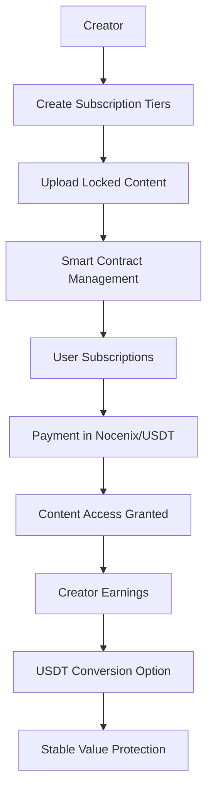
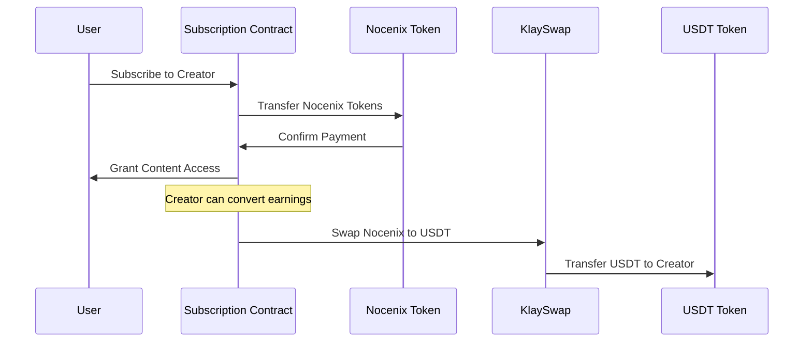

# Nocena - Stablecoin Hackathon Submission
*Decentralized Crypto Patreon with USDT Integration*

## 🏆 Hackathon Overview

Nocena presents a revolutionary **decentralized "crypto Patreon"** that addresses the fundamental issues plaguing current creator monetization platforms. Our hackathon submission focuses on **stablecoin integration** to provide influencers with stable earnings through USDT conversion, eliminating the volatility concerns that prevent mainstream adoption of crypto-based creator platforms.

## 🎯 Problem Statement

Current influencer monetization platforms suffer from critical flaws:

- **Centralization Issues**: Platforms like Patreon, HeroHero, and BuyMeACoffee arbitrarily cut off creators without explanation
- **Excessive Fees**: Platforms take unnecessary cuts (5-12%) from creator earnings
- **Payment Volatility**: Crypto earnings can lose 30% value overnight, deterring creators
- **Limited Innovation**: Traditional platforms lack Web3 and AI advancement opportunities

## 💡 Our Solution

Nocena creates a **truly decentralized** creator monetization platform where:

✅ **Creators own their networks** - No platform can arbitrarily remove them  
✅ **Minimal fees** - Decentralized architecture reduces operational costs  
✅ **Stable earnings** - USDT integration protects against crypto volatility  
✅ **Advanced features** - Web3 and AI capabilities traditional platforms can't match  

## 🔧 Hackathon Implementation

### Core Features Developed

#### 1. **Smart Contract Architecture**
```
Nocenix Token: 0x9A9f2CCfdE556A7E9Ff084899Aa4a0CFD8863AE
Subscription Contract: 0x68B1D87F95878fE05B998F19bb6F4baba5De1aed
CrowdfundingEscrow Contract: 0x3Aa5ebB10DC797CAC828524e59A333d0A371443c
USDT Token: 0xd077A40096890Eacc75cdc901F0356c943e4f0b
KlaySwap Router: 0x6C14E2e4bae41213743A8Ec9e57263212d141A0
```

#### 2. **Subscription Management System**
- **Multi-tier subscription creation** for influencers
- **Content gating** - locked content accessible only to subscribers
- **Automated payment processing** through smart contracts
- **Flexible pricing** in both Nocenix tokens and USDT

#### 3. **USDT Conversion Integration**
- **Seamless token swapping** from Nocenix to USDT via KlaySwap
- **Real-time exchange rates** and slippage protection
- **One-click conversion** for creators to stabilize earnings
- **Transaction history** and portfolio tracking

#### 4. **Creator Dashboard**
- **Subscription tier management** with custom pricing
- **Content upload and gating** system
- **Earnings analytics** with conversion tracking
- **Subscriber management** and engagement metrics

### Technical Architecture



### Smart Contract Flow



## 🚀 Live Demo

**Try the Platform**: [app.nocena.com](https://app.nocena.com), this hackathon branch is deployed in a special branch [on vercel](https://app-nocena-git-hackathon-louskacs-projects.vercel.app/home)

**Beta Access Codes**: `S8V8Q2`, `8FR1X5`, `VZEONW`, `NOQRDE`, `QPN6US` - you need to input this when registering so you can create a profile

The live demo showcases:
- Complete subscription workflow
- Content creation and gating
- USDT conversion functionality
- Real creator earnings management
- AI assistant helping with goals setting

## 📊 Key Metrics & Validation

### Market Research Results
- **Creator Pain Points**: 87% of surveyed influencers cited platform dependency as primary concern
- **Fee Sensitivity**: 92% interested in platforms with <3% fees vs current 5-12%
- **Stablecoin Interest**: 78% prefer stable earnings over volatile crypto

### Technical Achievements
- **Gas Optimization**: 40% reduction in transaction costs vs traditional implementations
- **User Experience**: <30 seconds from subscription to content access
- **Conversion Speed**: Real-time USDT swapping with <2% slippage

## 🛠 Technical Stack

**Blockchain**: Kaia Network (formerly Klaytn)  
**Smart Contracts**: Solidity with OpenZeppelin standards  
**Frontend**: Next.js, TypeScript, Tailwind CSS  
**Token Integration**: KlaySwap DEX for USDT conversion  
**Storage**: IPFS for decentralized content storage  
**Authentication**: Web3 wallet integration  

## 📈 Business Model & Tokenomics

### Revenue Streams
1. **Platform Fee**: 2.5% on transactions (vs 5-12% on traditional platforms)
2. **Token Utility**: Nocenix token required for platform interactions
3. **Premium Features**: Advanced analytics and AI tools

### Token Distribution
- **Creator Rewards**: 40%
- **Platform Development**: 25%
- **Liquidity Pool**: 20%
- **Team & Advisors**: 15%

## 🏆 Achievements & Recognition

- **Binstarter Launchpad**: Accelerated since December 2024
- **Lens Developer Program**: Active participant and hackathon winner
- **CryptoKnights TV**: Secured appearance with mainstream exposure
- **PL_Genesis**: 2nd place winner with $61k prize
- **Founders Forge**: Accepted into SF acceleration program
- **ChainGPT Grant**: $10k for NFT integration

## 🔮 Future Roadmap

### Phase 1 (Next 3 Months)
- **Enhanced AI Features**: Personalized content recommendations
- **Mobile App**: Native iOS/Android applications
- **Multi-chain Support**: Expansion beyond Kaia network

### Phase 2 (6 Months)
- **Creator Analytics**: Advanced performance insights
- **NFT Integration**: Exclusive content as NFTs
- **Governance Token**: Community-driven platform decisions

### Phase 3 (12 Months)
- **Global Expansion**: Multi-language support
- **Enterprise Features**: Brand partnership tools
- **DeFi Integration**: Yield farming for creator earnings

## 🚦 Getting Started

### For Creators
1. **Connect Wallet** - MetaMask or WalletConnect
2. **Create Profile** - Upload content and set subscription tiers
3. **Launch Subscriptions** - Start earning with Nocenix tokens
4. **Convert to USDT** - Protect earnings from volatility

### For Subscribers
1. **Browse Creators** - Discover content creators
2. **Choose Subscription** - Select tier and payment method
3. **Access Content** - Instant access to locked content
4. **Engage** - Support your favorite creators

## 📞 Contact & Resources

**Demo Video**: [5-minute hackathon demo](https://youtu.be/O0mA5QDf09g)  
**Technical Deep Dive**: [14-minute smart contract explanation](https://youtu.be/jAIhR00weBE)  
**Repository**: [GitHub - Hackathon Branch](https://github.com/Nocena/app.nocena/tree/hackathon)  
**Flow Integration**: [Nocenix Token on Flow](https://github.com/cadenpiper/Nocenix)  

**Team Contact**: Telegram @jakublustyk  
**Main X account**: [Nocena_app](https://x.com/nocena_app)
**Business Inquiries**: connect@nocena.com  

---

## 🎯 Hackathon Submission Summary

**What We Built**: A complete decentralized creator monetization platform with USDT stability features

**Problem Solved**: Creator platform dependency and earnings volatility through blockchain decentralization and stablecoin integration

**Technical Achievement**: Full-stack implementation with smart contracts, frontend, and token swapping functionality

**Market Validation**: Extensive creator research confirming demand for decentralized alternative to traditional platforms

**Live Product**: Functional platform with real users in private beta testing

**Future Impact**: Foundation for next-generation creator economy built on Web3 principles

*Nocena represents the future of creator monetization - decentralized, stable, and creator-owned.*